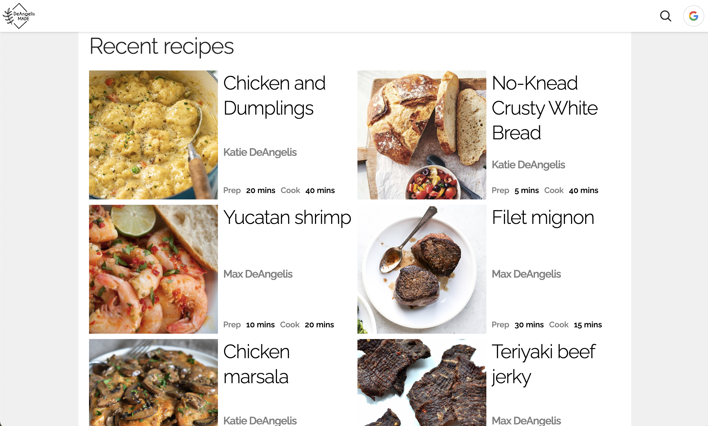
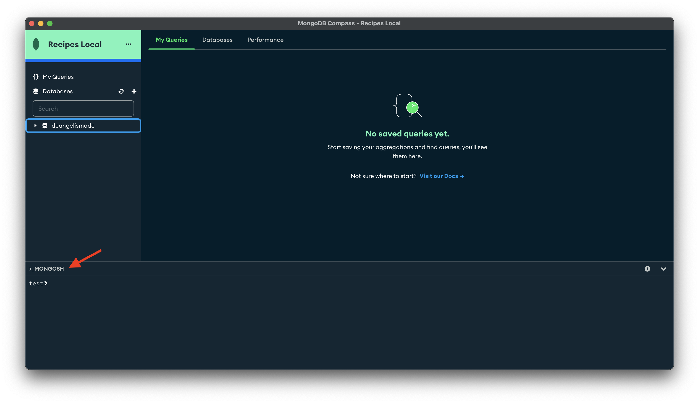
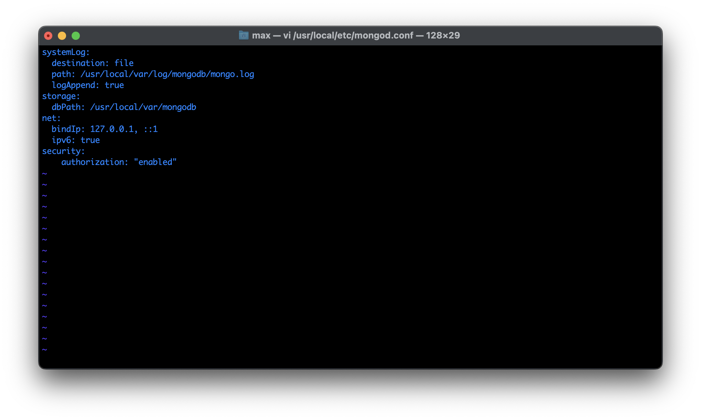

# Welcome to DeAngelis Made



DeAngelisMade is meant to be a dirt simple recipe archive of all our favorite recipes.

### Local Setup

##### Install Homebrew

1. Run `/bin/bash -c "$(curl -fsSL https://raw.githubusercontent.com/Homebrew/install/HEAD/install.sh)"` in terminal
2. Close any open terminals

##### Install Mongo DB

1. Follow [these](https://www.mongodb.com/docs/manual/tutorial/install-mongodb-on-os-x/) Mongo instructions to install with Brew

##### Configure Mongo

1. Open **MongoDB Compass App**
2. Connect to default `mongodb://localhost:27017` server
3. Open MongoDB Terminal
   _You can also just run `mongosh` in terminal_
   
4. Run the following commands **one at a time** to create an admin user
   ```
   use admin
   ```
   ```
   db.createUser(
       {
           user: "adminUser",
           pwd: "<PASSWORD>",
           roles: [ { role: "userAdminAnyDatabase", db: "admin" } ]
       }
   )
   ```
   ```
   db.createUser(
       {
           user: "adminUser",
           pwd: “password”,
           roles: [ { role: "userAdminAnyDatabase", db: "admin" } ]
       }
   )
   ```
5. Configure mongo to start in secure mode
   - go back to regular **terminal**
   - edit the mongodb [config file](https://www.mongodb.com/docs/manual/reference/configuration-options/#configuration-file)
   - run `vi /usr/local/etc/mongod.conf` (Mac OS)
   - run `vi <install directory>\bin\mongod.cfg` (Windows)
   - uncomment the following block
   ```
   security:
       authorization: "enabled"
   ```
   
6. Restart service by running `brew services restart mongodb-community`
7. Go back to **MongoDB Compass** app and configure new connection using `mongodb://adminUser:<PASSWORD>@localhost:27017/?authMechanism=DEFAULT&authSource=deangelismade`

##### Configure local enviroment

1. Clone this repo
2. Setup `.env` file within **backend** directory and add the following
   ```
   PORT=3001
   DB_USER="adminUser"
   DB_PASSWORD="<PASSWORD>"
   DB_IP="localhost"
   IMAGE_SERVER="http://localhost"
   VITE_GOOGLE_CLIENT_ID=<GOOGLE API KEY>
   ```
3. Setup `.env` file within **frontend** directory and add the following
   ```
   VITE_GOOGLE_CLIENT_ID=<GOOGLE API KEY>
   ```
4. Build by running `npm run build`
   - This will also install in all directories

**_You are now all set and ready to devlop!_**

### Development

For regular developmennt run `npm run dev`to start a live reload server for both the **backend** and **frontend**

### Deployment

Upon successful pull request, changes will be auto deployed to https://DeAngelisMade.com/
